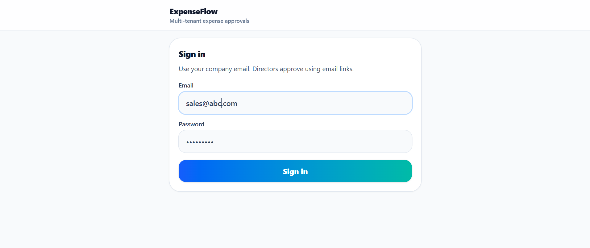

# ExpenseFlow

## Problem

Field teams submit expenses with paper receipts, approvals happen late (or not at all), and finance spends time chasing people instead of closing books. There’s no clean audit trail and visibility is poor.

## Solution

ExpenseFlow is a cloud-based, multi-tenant expense management system that supports fast expense submission (receipt + details), email-driven director approvals (no login needed), and a finance-ready queue with export.

## Features

- Auth (JWT + refresh tokens)
- Role-based access (Super Admin, Company Admin, Sales, Director, Finance)
- Multi-tenant company isolation (company/domain-based)
- Expense submission (draft → submitted) + receipt upload
- Email-driven approvals (Approve/Reject/Open details via PWA, token-based)
- Finance queue (approved → verified → posted) + CSV export
- Audit logs + in-app notifications

## Tech Stack

- React (PWA) + Vite
- Tailwind CSS
- Node.js (Fastify)
- PostgreSQL
- Email: Mailtrap / SMTP / SendGrid (provider-switchable)

## Architecture

Frontend → Backend → DB:

```mermaid
flowchart LR
  PWA[PWA (React + Tailwind + Vite)] -->|HTTPS JSON + multipart| API[API (Node.js + Fastify)]
  API --> DB[(PostgreSQL)]
  API --> Storage[(Receipt files: local uploads / S3 later)]
  API --> Mail[Email provider (Mailtrap / SMTP / SendGrid)]
```

## Screenshots

Add 3–5 images in `docs/screenshots/` and reference them here:

```md



```

## API Example

Create an expense (multipart with receipt):

```http
POST /expenses
Authorization: Bearer <token>
Content-Type: multipart/form-data

amount=4500
currency=KES
category=Meals
description=lunch at kempinski
receipt=<file>
```

Submit for approval (triggers director email):

```http
POST /expenses/:id/submit
Authorization: Bearer <token>
```

## Setup

Prereqs:

- Node.js 20+ recommended
- Docker (optional, for local Postgres)

Start PostgreSQL (Docker):

```powershell
cd expenseflow-mobile-first
docker compose up -d db
```

Install deps (repo root):

```powershell
cd expenseflow-mobile-first
npm install
```

Run API:

```powershell
npm -w services/api run dev
```

Run Mobile PWA:

```powershell
npm -w apps/mobile run dev
```

Environment variables (do not commit `.env` files):

- `services/api/.env`: DB connection, `PUBLIC_BASE_URL`, `APP_BASE_URL`, `ORIGIN`, mail provider settings
- `apps/mobile/.env`: `VITE_API_BASE_URL`

Managed Postgres often requires SSL/TLS:

- Set `DB_SSL=true`
- If your provider uses a non-standard chain, set `DB_SSL_REJECT_UNAUTHORIZED=false`

Bootstrap (first Super Admin):

- This repo intentionally does not auto-seed users in production.
- Create the first `super_admin` directly in Postgres (Render/DBeaver), then log into the PWA.

## Live Demo

- (Add link here)

## Demo Flow

1) **Super Admin**: create a company (domain-based)
2) **Company Admin**: create users (Sales, Director, Finance) and set the default director in **Settings**
3) **Sales**: create an expense (attach receipt photo)
4) Tap **Submit** → director gets an email with Approve/Reject/Open details
5) **Director**: approve via email link (PWA opens, no login required)
6) **Finance**: verify + post, then export CSV

